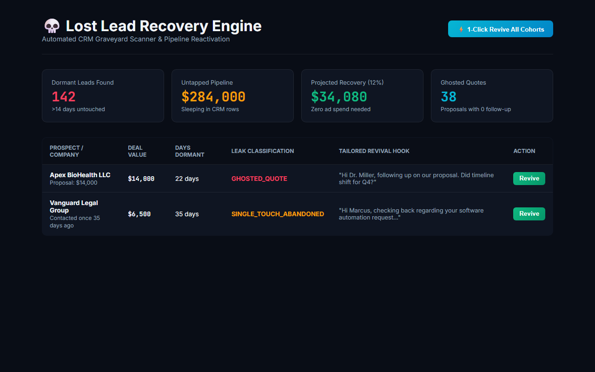

# Lost Lead Recovery Engine (Weapon #04 in the Master 50 Arsenal)

> **CRM Graveyard Scanner & Pipeline Reactivation: Audits dormant CRM records, flags untouched warm leads and ghosted quotes, and drafts high-conversion revival batches with zero additional ad spend.**

[](test/lost-lead.test.js)
[]()

---

## 🚀 Live Interactive Simulator & Proof

[](https://gideonbawa-website.netlify.app/simulators/lost-lead-recovery-engine/)

* 🌐 **Live In-Browser Simulator:** [https://gideonbawa-website.netlify.app/simulators/lost-lead-recovery-engine/](https://gideonbawa-website.netlify.app/simulators/lost-lead-recovery-engine/)
* 💼 **Portfolio Showcase:** [https://gideonbawa-website.netlify.app/#work](https://gideonbawa-website.netlify.app/#work)
* 🛡️ **Verified QA Evidence:** HMAC-SHA256 Signed Contract (`ev-qa-contract-1791285928367-lost-lead-recovery-engine`)

---


## 💸 Commercial Problem & Economic Pain
Companies spend thousands buying new leads while **hundreds of warm prospects sit untouched in their CRM database**.
Classifying and reviving them produces an immediate **10% to 18% pipeline unlock**.

## 🏗️ Operational Flow
```text
CRM EXPORT / API ──► Scans untouched contacts and open deals
       │
COHORT CLASSIFIER ──► Ghosted Quotes (>7d), Single-Touch (>14d), Zero-Touch (>3d)
       │
REVIVAL COMPILER ──► Compiles low-friction personalized re-engagement hooks
       │
DISPATCH QUEUE ──► 1-Click batch reactivation via Email / SMS / LinkedIn
```
